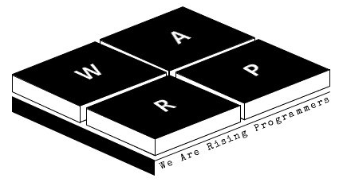

# winapi-framework
__WinAPI기반 프레임워크입니다.__
  
  

----

__목적__
  1. 2학년 1학기 윈도우프로그래밍 과목을 듣는 워프분들에게, 참고할만한 프레임워크 제작
  2. WinAPI 기반 프로젝트 개발 시, 활용할만한 프레임워크 제작

----
  
__Contributor__
  - [이소현](https://github.com/leesohyun129)
  - [김영태](https://github.com/on1659)
  - [김도율](https://github.com/LusainKim)
  - [원성연](https://github.com/GameForPeople)

----

__저작권__
  - Copyright ⓒ https://github.com/KPU-WARP
  - 무단 전재 및 재배포 금지
  - 코드 사용 시, 19년도 워프 회장 이소현님에게 연락하시길 바랍니다.
  - 새로 생성되는 모든 코드에는 저작권을 표시해주시면 감사하겠습니다.

----

__프로젝트 생성시 고려사항__
  - 친절한 주석
  - FPS 윈도우 표시는 WM_TIMER 기반이므로 개발하지 않았습니다.
  - PeekMessage 기반입니다.
  - 더블 버퍼링은 WM_PAINT에서 진행합니다.

----

__제한사항__
 - C++ 기반 입니다. 
 - 안타깝게도, 윈도우 프로그래밍 과목 수강(2학년 1학기)하시는 분들을 위한 코드이기 때문에 STL 사용을 제한합니다.

----
 
__현재 적용 된 코딩 컨벤션__
 - 모든 파일 위에 저작권을 명시한다.
 - 클래스 앞에는 Warp에 W를 붙여 생성한다.
 - 멤버변수는 m_ 을 접두사로 사용합니다.
 - 항상 호출되는 함수에는 On을 붙여 줍니다.

----

__알려진 이슈__

>* Clone 후, Visual Studio에서 최초 실행 시, "Windows.h"를 비롯한 여러 헤더들을 오픈할 수 없다고 나오는 이슈
>> 해결 방법
>> 1. 위의 메뉴에서 "프로젝트" 클릭
>> 2. 가장 아래 "속성(Client 속성) 클릭
>> 3. "구성 속성" - "일반" 에서, SDK 버전을 "8.1"로 바꾸고, 적용 확인.
>> 4. 1번, 2번을 다시 한 후, SDK버전을 다시 "10.xx"로 변경 후, 컴파일.

